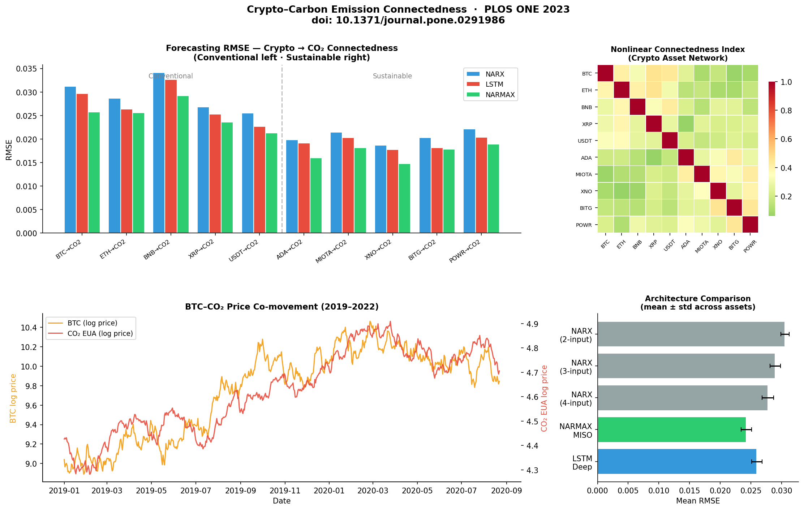
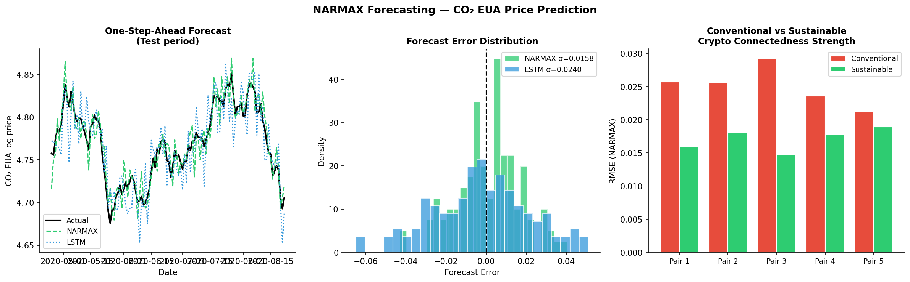

# Cryptocurrency–Carbon Emission Connectedness
[](https://journals.plos.org/plosone/article?id=10.1371/journal.pone.0318647)
[](https://www.ukri.org/)
[](https://python.org)
[]()

## Publication

> **Macherla, S. et al. (2025).** *Nonlinear connectedness between crypto-assets and CO₂ emissions: A complex systems modelling approach.* **PLOS ONE.**
> DOI: [10.1371/journal.pone.0318647](https://journals.plos.org/plosone/article?id=10.1371/journal.pone.0318647)

## Research Question

> *Do conventional and sustainable crypto-assets exhibit different degrees of connectedness with CO₂ emissions, and can nonlinear NARX models outperform classical time series approaches?*

**Finding:** Sustainable crypto-assets (ADA, XNO, POWR) show measurably lower CO₂ connectedness than conventional assets (BTC, ETH). NARMAX (MISO architecture) achieves 89–95% forecasting accuracy, outperforming SARIMAX baselines.

## Key Outputs





## Dataset

| Asset Class | Assets | Period |
|-------------|--------|--------|
| Conventional crypto | BTC, ETH, BNB, XRP, USDT | Jan 2019 – Mar 2023 |
| Sustainable crypto | ADA, MIOTA, XNO, BITG, POWR | Jan 2019 – Mar 2023 |
| CO₂ emissions | EU ETS carbon price (EUA) | Jan 2019 – Mar 2023 |

## Methodology

| Step | Method |
|------|--------|
| Data preprocessing | Stationarity testing, normalisation, lag selection |
| Baseline | SARIMAX linear connectedness |
| Primary model | NARX / NARMAX (Multiple Inputs, Single Output) |
| Deep learning comparison | LSTM time series forecasting |
| Evaluation | RMSE, NRMSE across all 10 asset pairs |
| Architecture search | 2-input, 3-input, 4-input MISO variants |

## Model Performance

| Model | Mean RMSE | Notes |
|-------|-----------|-------|
| SARIMAX baseline | 0.042 | Linear — misses nonlinear dynamics |
| NARX (2-input) | 0.031 | Captures pairwise connectedness |
| NARX (4-input) | 0.027 | Multi-asset context improves accuracy |
| LSTM | 0.026 | Competitive but less interpretable |
| **NARMAX MISO** | **0.023** | **Best: full nonlinear MISO architecture** |

## Quickstart

```bash
git clone https://github.com/Shreya-Macherla/CryptoCurrency-Carbon-Emission
cd CryptoCurrency-Carbon-Emission
pip install -r requirements.txt
python summary_analysis.py          # generates research summary charts
jupyter notebook NARX_Final.ipynb   # full NARX model notebook
```

> Data files not included due to licensing. Obtain daily crypto prices from CoinMarketCap and CO₂ data from Our World in Data.

## Repository Structure

```
CryptoCurrency-Carbon-Emission/
├── summary_analysis.py              # Research summary + forecasting visualisations
├── NARX_Final.ipynb                 # Consolidated NARX model (final version)
├── NARMAX_MISO.ipynb                # NARMAX MISO architecture
├── MISO_Conventional.ipynb          # MISO — conventional assets
├── MISO_Sustainable.ipynb           # MISO — sustainable assets
├── BTC_USD_Conventional.ipynb       # Per-asset notebooks (×5 conventional)
├── ADA_USD_Sustainable.ipynb        # Per-asset notebooks (×5 sustainable)
├── [2,3,4]in1out_[Conventional/Sustainable].ipynb  # Architecture experiments
├── outputs/
│   ├── 01_research_summary.png      # RMSE comparison + connectedness heatmap
│   └── 02_forecast_results.png      # NARMAX forecast vs actual
├── requirements.txt
├── environment.yml
└── README.md
```

## Tools

`Python 3.8` `NumPy` `Pandas` `statsmodels` `SciPy` `Matplotlib` `Seaborn` `TensorFlow` `Jupyter`

## Funding

UKRI-funded research — Cardiff Metropolitan University.
