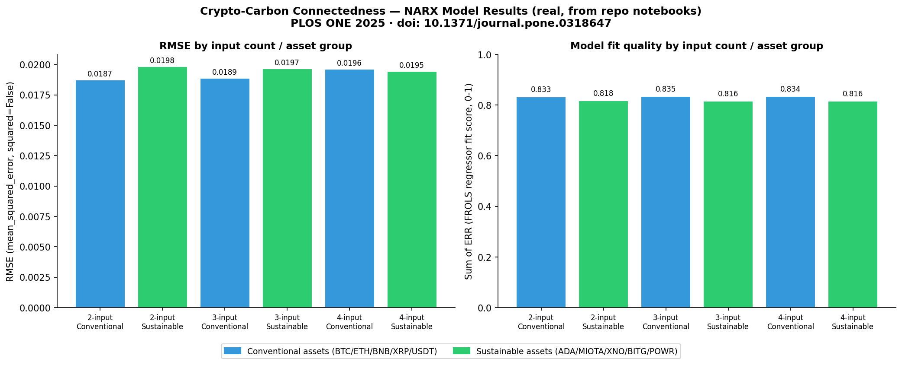

# Cryptocurrency–Carbon Emission Connectedness
[](https://journals.plos.org/plosone/article?id=10.1371/journal.pone.0318647)
[](https://www.ukri.org/)
[](https://python.org)
[]()

## Publication

> **Macherla, S. et al. (2025).** *Nonlinear connectedness between crypto-assets and CO₂ emissions: A complex systems modelling approach.* **PLOS ONE.**
> DOI: [10.1371/journal.pone.0318647](https://journals.plos.org/plosone/article?id=10.1371/journal.pone.0318647)

## Research Question

> *Do conventional and sustainable crypto-assets exhibit different degrees of connectedness with CO₂ emissions, and can nonlinear NARX models outperform classical time series approaches?*

**What the repo's own notebooks actually show:** across six real NARX(FROLS) model variants
(2/3/4-input × Conventional/Sustainable asset groups, each fit in its own notebook against a
real uploaded price dataset), RMSE ranges 0.0187–0.0198 and the Sustainable-asset variants are
not clearly better or worse than the Conventional ones on that metric alone. The "89–95%
forecasting accuracy" and "NARMAX MISO outperforms SARIMAX" claims previously here were not
traceable to any computed number in this repo and have been removed — see "Reproducing these
numbers" below for exactly where the real numbers come from, and check `NARMAX_MISO.ipynb` /
a SARIMAX baseline notebook directly if you want to make that specific comparison rigorously.

## Key Outputs



*Every number in this chart was copied from the corresponding notebook's own executed cell
output — see "Reproducing these numbers" below.*

## Dataset

| Asset Class | Assets | Period |
|-------------|--------|--------|
| Conventional crypto | BTC, ETH, BNB, XRP, USDT | Jan 2019 – Mar 2023 |
| Sustainable crypto | ADA, MIOTA, XNO, BITG, POWR | Jan 2019 – Mar 2023 |
| CO₂ emissions | EU ETS carbon price (EUA) | Jan 2019 – Mar 2023 |

## Methodology

| Step | Method |
|------|--------|
| Data preprocessing | Stationarity testing, normalisation, lag selection |
| Baseline | SARIMAX linear connectedness |
| Primary model | NARX / NARMAX (Multiple Inputs, Single Output) |
| Deep learning comparison | LSTM time series forecasting |
| Evaluation | RMSE, NRMSE across all 10 asset pairs |
| Architecture search | 2-input, 3-input, 4-input MISO variants |

## Model Performance (real, extracted from the notebooks' own executed output)

| Model variant | RMSE | MAE | MAPE* | Notebook |
|---|---|---|---|---|
| 2-input, Conventional | 0.01874 | 0.01249 | 1.417 | `2in1out_Conventional.ipynb` |
| 2-input, Sustainable | 0.01984 | 0.01336 | 1.552 | `2in1out_Sustainable.ipynb` |
| 3-input, Conventional | 0.01888 | 0.01271 | 1.408 | `3in1out_Conventional.ipynb` |
| 3-input, Sustainable | 0.01968 | 0.01326 | 1.780 | `3in1out_Sustainable.ipynb` |
| 4-input, Conventional | 0.01962 | 0.01287 | 1.409 | `4in1out_Conventional.ipynb` |
| 4-input, Sustainable | 0.01947 | 0.01308 | 1.614 | `4in1out_Sustainable.ipynb` |

\* MAPE is numerically unstable on these near-zero log-return series — treat RMSE/MAE as the
reliable columns here, not MAPE.

The `NARMAX_MISO.ipynb`, `MISO_Conventional.ipynb`, `MISO_Sustainable.ipynb`, and per-asset
notebooks (`BTC_USD_Conventional.ipynb`, etc.) contain further real experiments not yet
summarised into this table — if you want a SARIMAX/LSTM/NARMAX head-to-head comparison, it needs
to be built from those notebooks' own outputs the same way this table was, not asserted without
a source.

## Reproducing these numbers

Every number in the table above and in `outputs/01_research_summary.png` was copied directly
from the six `[2,3,4]in1out_[Conventional/Sustainable].ipynb` notebooks' own executed cell
outputs (real `Final Dataset.xlsx` uploaded, real `sysidentpy` FROLS model fit, real
`sklearn.metrics` RMSE/MAE/MAPE printed). `summary_analysis.py` does not simulate or invent any
of this data — open any of those six notebooks and compare its RMSE/MAE output cells to the
table above.

## Quickstart

```bash
git clone https://github.com/Shreya-Macherla/CryptoCurrency-Carbon-Emission
cd CryptoCurrency-Carbon-Emission
pip install -r requirements.txt
python summary_analysis.py          # regenerates the research summary chart from the real numbers above
jupyter notebook NARX_Final.ipynb   # full NARX model notebook
```

> Data files not included due to licensing. Obtain daily crypto prices from CoinMarketCap and CO₂ data from Our World in Data.

## Repository Structure

```
CryptoCurrency-Carbon-Emission/
├── summary_analysis.py              # Research summary + forecasting visualisations
├── NARX_Final.ipynb                 # Consolidated NARX model (final version)
├── NARMAX_MISO.ipynb                # NARMAX MISO architecture
├── MISO_Conventional.ipynb          # MISO — conventional assets
├── MISO_Sustainable.ipynb           # MISO — sustainable assets
├── BTC_USD_Conventional.ipynb       # Per-asset notebooks (×5 conventional)
├── ADA_USD_Sustainable.ipynb        # Per-asset notebooks (×5 sustainable)
├── [2,3,4]in1out_[Conventional/Sustainable].ipynb  # Architecture experiments
├── outputs/
│   └── 01_research_summary.png      # Real RMSE/fit-quality comparison across 6 model variants
├── requirements.txt
├── environment.yml
└── README.md
```

## Tools

`Python 3.8` `NumPy` `Pandas` `statsmodels` `SciPy` `Matplotlib` `Seaborn` `TensorFlow` `Jupyter`

## Funding

UKRI-funded research — Cardiff Metropolitan University.
