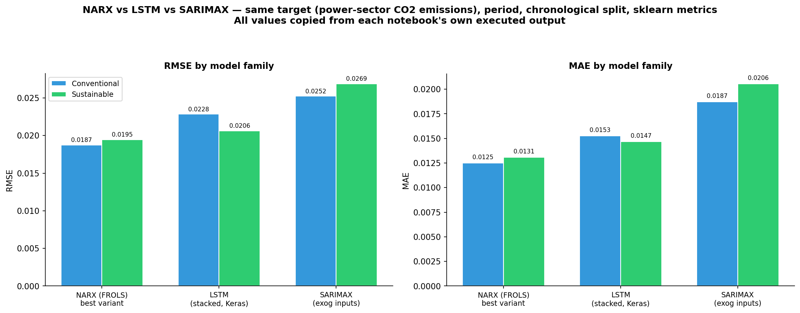

# Cryptocurrency–Carbon Emission Connectedness
[](https://journals.plos.org/plosone/article?id=10.1371/journal.pone.0318647)
[](https://python.org)
[-red)]()

## Publication

> **Khan MH, Macherla S, Anupam A (2025).** *Nonlinear connectedness of conventional crypto-assets and sustainable crypto-assets with climate change: A complex systems modelling approach.* **PLoS ONE 20(2): e0318647.**
> (Macherla: Formal analysis, Software, Visualization — 2nd author)
> DOI: [10.1371/journal.pone.0318647](https://journals.plos.org/plosone/article?id=10.1371/journal.pone.0318647)

## Research Question

> *Do conventional and sustainable crypto-assets exhibit different degrees of connectedness with CO₂ emissions, and can nonlinear NARX models outperform classical time series approaches?*

**What the repo's own notebooks actually show:** across six real NARX(FROLS) model variants
(2/3/4-input × Conventional/Sustainable asset groups), RMSE ranges 0.0187–0.0198. Under the
same target, period, chronological split, and sklearn metrics, the LSTM comparison models (also reported in the paper, Tables 6–7)
achieve RMSE 0.0206–0.0228, and the SARIMAX baselines — a **repo extension beyond the paper**,
which compares NARX against LSTM only — achieve RMSE 0.0252–0.0269 — so **NARX(FROLS)
achieves the lowest RMSE and MAE in both asset groups**, supporting the paper's premise that
the nonlinear NARX approach outperforms both a classical statistical baseline and a
deep-learning alternative on this data. On the connectedness question itself, the paper reports that conventional
crypto-assets show slightly stronger connectedness with CO₂ emissions than sustainable ones
(Sum of ERR 0.834 vs 0.819 for the full MISO models) — cite that finding to the paper, not to
RMSE differences, since within NARX the two groups are not clearly separable on RMSE alone. Every number is copied from
the corresponding notebook's own executed cell output — see "Reproducing these numbers" below.

## Key Outputs




*Every number in these charts was copied from the corresponding notebook's own executed cell
output — see "Reproducing these numbers" below.*

## Dataset

| Asset Class | Assets | Period |
|-------------|--------|--------|
| Conventional crypto (inputs) | BNB, BTC, ETH, USDT, XRP — daily trading volumes (USD), log-returns | Jan 2, 2019 – Mar 31, 2023 |
| Sustainable crypto (inputs) | ADA, BITG, MIOTA, XNO, POWR — daily trading volumes (USD), log-returns | Jan 2, 2019 – Mar 31, 2023 |
| CO₂ emissions (output) | World power-sector CO₂ emissions, Carbon Monitor | Jan 2, 2019 – Mar 31, 2023 |

## Methodology

| Step | Method |
|------|--------|
| Data preprocessing | Stationarity testing, normalisation, lag selection |
| Primary model | NARX / NARMAX via sysidentpy FROLS (Multiple Inputs, Single Output) |
| Deep-learning comparison (paper, Tables 6–7) | Stacked LSTM (5 layers: 350→300→250→200→150 units, Dropout 0.3, Dense(1)), Keras/TensorFlow, window 7, Adam/MSE, 40 epochs, 85/15 chronological split |
| Classical baseline (repo extension, not in the paper) | SARIMAX with crypto series as exogenous regressors, grid-searched orders (Conventional (0,0,2)×(1,0,2,12); Sustainable (1,1,2)×(0,0,1,12)) |
| Evaluation | RMSE, MAE, MAPE (sklearn) + FROLS Sum-of-ERR per NARX variant |
| Architecture search | 2-input, 3-input, 4-input MISO variants × Conventional/Sustainable groups |

## Model Performance (real, extracted from the notebooks' own executed output)

| Model variant | RMSE | MAE | MAPE* | Notebook |
|---|---|---|---|---|
| NARX 2-input, Conventional | 0.01874 | 0.01249 | 1.417 | `2in1out_Conventional.ipynb` |
| NARX 2-input, Sustainable | 0.01984 | 0.01336 | 1.552 | `2in1out_Sustainable.ipynb` |
| NARX 3-input, Conventional | 0.01888 | 0.01271 | 1.408 | `3in1out_Conventional.ipynb` |
| NARX 3-input, Sustainable | 0.01968 | 0.01326 | 1.780 | `3in1out_Sustainable.ipynb` |
| NARX 4-input, Conventional | 0.01962 | 0.01287 | 1.409 | `4in1out_Conventional.ipynb` |
| NARX 4-input, Sustainable | 0.01947 | 0.01308 | 1.614 | `4in1out_Sustainable.ipynb` |
| LSTM (stacked), Conventional | 0.02284 | 0.01527 | 1.163 | `MISO_Conventional_LSTM_.ipynb` |
| LSTM (stacked), Sustainable | 0.02063 | 0.01468 | 1.030 | `MISO_Sustainable_LSTM.ipynb` |
| SARIMAX (exog), Conventional | 0.02523 | 0.01871 | 1.338 | `MISO_Conventional_SARIMAX.ipynb` |
| SARIMAX (exog), Sustainable | 0.02688 | 0.02055 | 1.369 | `MISO_Sustainable_SARIMAX_.ipynb` |

\* MAPE is numerically unstable on these near-zero log-return series — treat RMSE/MAE as the
reliable columns here, not MAPE.

The `NARMAX_MISO.ipynb`, `MISO_Conventional.ipynb`, `MISO_Sustainable.ipynb`, and per-asset
notebooks (`BTC_USD_Conventional.ipynb`, etc.) contain further real experiments not yet
summarised into this table — any additional comparison should be built from those notebooks'
own outputs the same way this table was.

## Reproducing these numbers

Every number in the table above and in `outputs/01_research_summary.png` /
`outputs/02_model_comparison.png` was copied directly from the named notebooks' own executed
cell outputs (real `Final Dataset.xlsx` uploaded; real sysidentpy FROLS, Keras LSTM, or
statsmodels SARIMAX model fit; real `sklearn.metrics` RMSE/MAE/MAPE printed).
`summary_analysis.py` does not simulate or invent any of this data — open any of the ten
source notebooks and compare its metric output cells to the table above.

## Quickstart

```bash
git clone https://github.com/Shreya-Macherla/CryptoCurrency-Carbon-Emission
cd CryptoCurrency-Carbon-Emission
pip install -r requirements.txt
python summary_analysis.py                        # regenerates both charts from the real numbers above
jupyter notebook NARX_Final.ipynb                 # full NARX model notebook
jupyter notebook MISO_Conventional_LSTM_.ipynb    # LSTM comparison model
jupyter notebook MISO_Conventional_SARIMAX.ipynb  # SARIMAX baseline
```

> Data files not included here; the full dataset is published with the paper as S1 Data (xlsx). Sources: trading volumes from CoinMarketCap / Yahoo Finance; power-sector CO₂ emissions from Carbon Monitor (https://carbonmonitor.org/).

## Repository Structure

```
CryptoCurrency-Carbon-Emission/
├── summary_analysis.py              # Research summary + cross-model comparison charts
├── NARX_Final.ipynb                 # Consolidated NARX model (final version)
├── NARMAX_MISO.ipynb                # NARMAX MISO architecture
├── MISO_Conventional.ipynb          # MISO — conventional assets
├── MISO_Sustainable.ipynb           # MISO — sustainable assets
├── MISO_Conventional_LSTM_.ipynb    # LSTM comparison — conventional assets
├── MISO_Sustainable_LSTM.ipynb      # LSTM comparison — sustainable assets
├── MISO_Conventional_SARIMAX.ipynb  # SARIMAX baseline — conventional assets
├── MISO_Sustainable_SARIMAX_.ipynb  # SARIMAX baseline — sustainable assets
├── BTC_USD_Conventional.ipynb       # Per-asset notebooks (×5 conventional)
├── ADA_USD_Sustainable.ipynb        # Per-asset notebooks (×5 sustainable)
├── [2,3,4]in1out_[Conventional/Sustainable].ipynb  # NARX architecture experiments
├── outputs/
│   ├── 01_research_summary.png      # Real RMSE/fit-quality comparison across 6 NARX variants
│   └── 02_model_comparison.png      # NARX vs LSTM vs SARIMAX (real numbers)
├── requirements.txt
├── environment.yml
└── README.md
```

## Tools

`Python 3.8` `NumPy` `Pandas` `sysidentpy` `statsmodels (SARIMAX)` `TensorFlow/Keras (LSTM)` `scikit-learn` `SciPy` `Matplotlib` `Seaborn` `Jupyter`

## Funding

Supported by internal funding (Impact RA Funding) from Cardiff Metropolitan University. The funders had no role in study design, data collection and analysis, decision to publish, or preparation of the manuscript. (Funding statement as published in the paper.)
